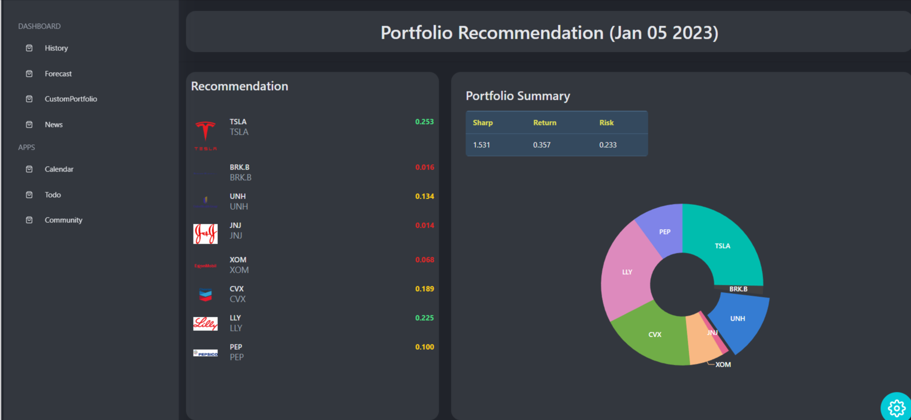
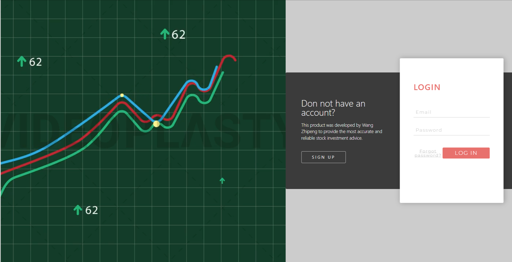
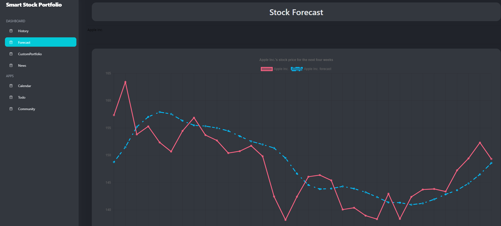
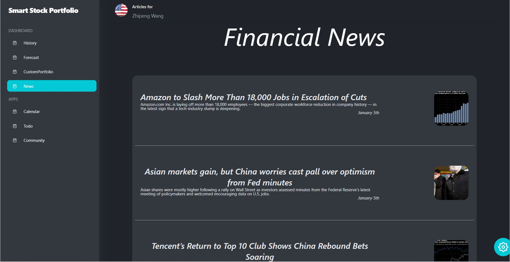

## SECTION 1 : PROJECT TITLE

## SmartPortfolioAdvisor

---

## SECTION 2 : EXECUTIVE SUMMARY

In this project, we demonstrate the use of Sharpe Ratio as a measure of portfolio fitness to evolve a portfolio of stocks using Genetic Algorithm. We also apply LSTM modeling to forecast future stock prices.

### The Log In and Sign Up

### The Stock Forecast

### The Financial News

---

## SECTION 3 : VIDEO OF SYSTEM MODELLING & USE CASE DEMO

###Link to video` `
Marketing Video: https://youtu.be/ImGwigIEQMo ` `
Technical Video: https://youtu.be/YzPpZMfF-SI ` `

---

## SECTION 4 : USER GUIDE

`Refer to User Guide at Github Folder: User Guide`

### To run the system in local machine:

#### System Requirements

Ubuntu 20.04  ` `
At least 2 Gb of hard disk space

#### Application Requirements

For frontend: application requirements to be installed using npm for dependencies listed in package.json ` `
For backend: application requiremetns to be installed using pip for dependencies listed in requirements.txt

---

## SECTION 5 : PROJECT REPORT / PAPER

`Refer to project report at Github Folder: ProjectReport`

**Sections for Project Report**

- Introduction
  - Business Value
  - Project Aim
- System Architecture
  - Deployment
- System Features
  - Stock Data Retrieval
  - Portfolio Recommendation of the day (based on Daily GA Run)
  - Custom Portfolio Recommendation (based on Custom GA Run)
  - Stock Price Forecasting
  - Historical Portfolio Recommendations
  - Financial News
- GA Algorithm for Portfolio Recommendation
- Knowledge Identification
  - Fitness Function Definition
  - Data specification
  - Hyperparameter specification
  - Knowledge specification
  - Chromosome
  - Fitness Value (Sharpe) Computation
    - Computation of Daily Return
    - Computation of Annualized Daily Return
    - Computation of Annualized Portfolio Variance
    - Computation of Risk Free Rate
    - Computation of Annual Sharpe Ratio
  - Population Selection and Generation
  - Crossover
  - Mutation
  - Termination Criteria
    - Single run termination criteria (convergence or max epoch)
    - Multi-run termination criteria (Sharpe Ratio 2, recursion depth of 5)
  - Knowledge Refinement
    - Algorithm Tuning
    - Key Performance Indicators
    - Run time optimizations
  - Limitations and Improvements
    - Too Slow!
    - Overly-dynamic portfolio recommendations
    - Only Linux
- LSTM Model for Stock Price Forecasting
  - Knowledge Identification
  - Knowledge Specification
    - Data preprocessing
    - Dataset creation
  - Knowledge Refinement
  - Limitations and improvements
- Conclusion
- References

---

## SECTION 6 : Miscellaneous

`Refer to Github Folder: Miscellaneous`

Efficient Frontier notebook used to generate the efficient frontier images. Note that the database to run the notebook can be found at Frontend/src/database/stocks.db
